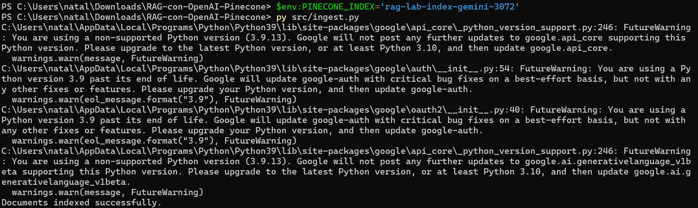
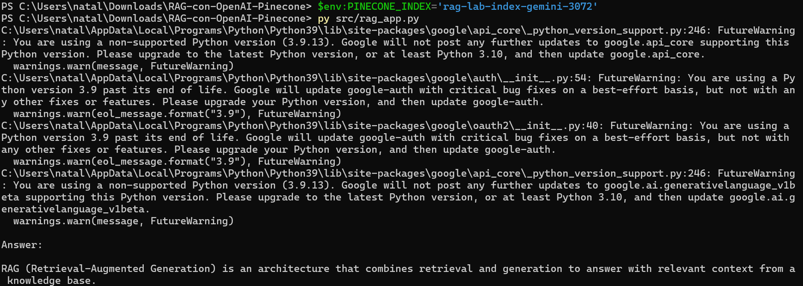

# Repository 2: RAG with LangChain + Gemini + Pinecone

This project implements a basic Retrieval-Augmented Generation (RAG) workflow using LangChain, Gemini, and Pinecone.

## 1. Architecture

- `src/ingest.py`: Creates (if needed) a Pinecone index, loads `data/sample.txt`, splits the text, generates embeddings, and stores chunks in Pinecone.
- `src/rag_app.py`: Builds a retriever + Gemini LLM chain and runs a sample question (`"What is RAG?"`).
- `.env.example`: Environment variable template.
- `requirements.txt`: Python dependencies.

### Main Components

- Embeddings: `GoogleGenerativeAIEmbeddings` with `models/gemini-embedding-001` (3072 dimensions).
- Vector store: `PineconeVectorStore`.
- Retriever: `vectorstore.as_retriever(search_kwargs={"k": 4})`.
- LLM: `ChatGoogleGenerativeAI` with `gemini-2.5-flash`.
- RAG chain: retriever -> prompt -> LLM -> text output.

## 2. Setup

### Prerequisites

- Python 3.9+ (recommended: 3.10+)
- Google Gemini API key
- Pinecone API key

### Installation

1. Create and activate virtual environment:
```powershell
py -m venv .venv
.\.venv\Scripts\Activate.ps1
```

2. Install dependencies:
```powershell
py -m pip install --upgrade pip
py -m pip install -r requirements.txt
```

3. Configure environment variables:
```powershell
Copy-Item .env.example .env
```

Edit `.env` with:
- `GOOGLE_API_KEY`
- `PINECONE_API_KEY`
- `PINECONE_INDEX`

4. Create input file for ingestion:
```powershell
New-Item -ItemType Directory -Force data
Set-Content data\sample.txt "RAG combines retrieval and generation to answer with context."
```

## 3. Run

1. Ingest text into Pinecone:
```powershell
py src/ingest.py
```

2. Run the RAG app:
```powershell
py src/rag_app.py
```

## 4. Example Output

```text
Documents indexed successfully.

Answer:
RAG combines retrieval and generation...
```

## 5. Evidence

The following evidence files were generated from real runs:

- `docs/ingest_output_success.txt`
- `docs/query_output_success.txt`

Commands used:

```powershell
$env:PINECONE_INDEX='rag-lab-index-gemini-3072'
py src/ingest.py *> docs/ingest_output_success.txt

$env:PINECONE_INDEX='rag-lab-index-gemini-3072'
py src/rag_app.py *> docs/query_output_success.txt
```

Result excerpts:

```text
Documents indexed successfully.
```

```text
Answer:
RAG (Retrieval-Augmented Generation) combines retrieval and generation...
```

Screenshots:




## 6. Notes

- `src/ingest.py` currently uses a fixed input path: `data/sample.txt`.
- Embedding dimension is set to `3072`, which matches `models/gemini-embedding-001`.
- If your Pinecone index was created with a different dimension, create a new index name in `.env`.
